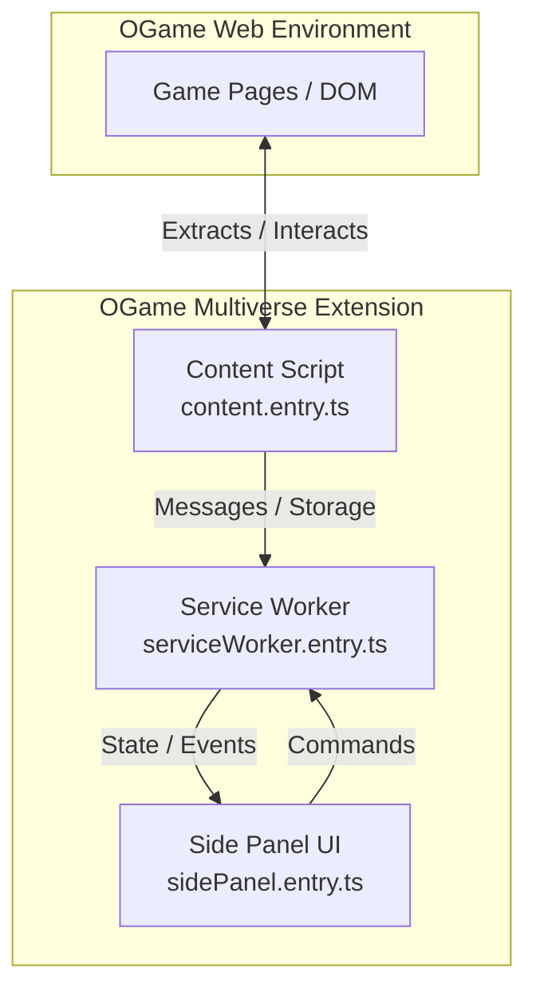

# OGame Multiverse

Browser extension (Chrome & Firefox) designed to track and manage activity across multiple OGame game servers (universes) simultaneously.
> [!WARNING]
> This extension is currently awaiting official validation on [OGame Origin](https://forum.origin.ogame.gameforge.com/forum/board/12-submissions-api-requests/) and is not yet among the officially tolerated tools. Use at your own risk. The author shall not be held responsible under any circumstances for any consequences or penalties arising from its use.

## 🚀 Key Features
- **Multi-universe tracking:** Centralized view of multiple game instances.
- **Smart tab management:** Open universe detection, quick switching, and click-to-activate tab features.
- **Refresh indicators:** Dynamic thresholds and customizable alerts.
- **Cross-browser support:** Compatible with Chrome and Firefox (note: due to Firefox lagging behind on certain web extension standards, some features may be exclusive to Chrome).

---

## 🛠️ Development & Build (For Contributors)

### Architecture & Contexts
The extension is built around three main execution entry points:
- **Content Script (`content.entry.ts`):** Runs directly within OGame web pages to interact with the game DOM and extract data.
- **Service Worker (`serviceWorker.entry.ts`):** Background script managing background tasks, storage, and events.
- **Side Panel (`sidePanel.entry.ts`):** Powers the extension's dedicated user interface side panel.




### Manual Compilation
The project includes a build script (`build.sh`) handling type-checking, bundling (via esbuild), and SCSS compilation.

To generate deployment packages:
```bash
chmod +x ./build.sh
./build.sh package
```
The final archives will be available in the `./dist/` directory.

### Tech Stack
- **Core:** TypeScript
- **Styles:** SCSS (Sass)
- **Bundling:** esbuild
